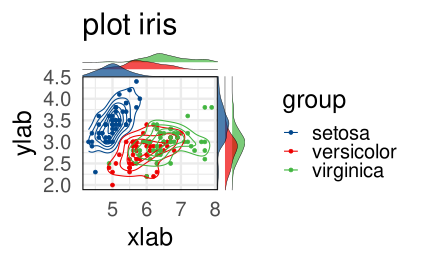

# ggScatRidges: Scatter combined to Ridgeline plots in ggplot2

THIS FUNCTION IS UNDER ACTIVE DEVELOPMENT. TRY AT YOUR OWN RISK IF YOU REALLY WANT TO, OTHERWISE WAIT UNTIL A STABLE VERSION IS PUBLISHED.

ggScatRidges is a simple function combining a scatter plot to a ridgeline plot to visualise the disparities of the data points.



## Installation

<!-- remove this when released to CRAN

Please install the stable release from CRAN:

``` r
install.packages("ggScatRidges")
```

-->


Alternatively, you can install the latest development version from
github:

``` r
remotes::install_github("matbou85/ggScatRidges")
```

## Usage

``` r
library(ggplot2)
library(ggScatRidges)
    
plot <- ggScatRidges(x = iris$Sepal.Length, y = iris$Sepal.Width, group= iris$Species, 
                    color = "lancet", ridges = T, title = "plot iris",
                    xlab = "xlab", ylab = "ylab", size = 25, draw = T) 

ggdraw(plot)

```


