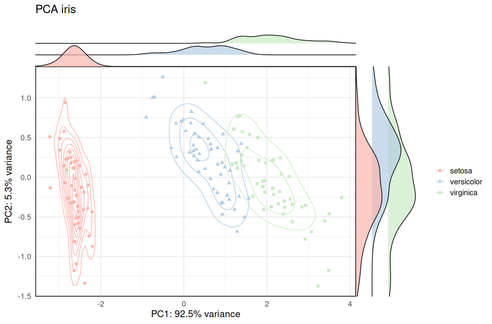

# ggScatRidges: Scatter combined to Ridgeline plots in ggplot2

`ggScatRidges` is a simple function combining a scatter plot to a ridgeline plot to visualise the disparities of the data points. This helps visualising the distribution of different groups in the data.


## Installation

<!-- remove this when released to CRAN

Please install the stable release from CRAN:

``` r
install.packages("ggScatRidges")
```

-->


Alternatively, you can install the latest development version from github:

``` r
remotes::install_github("matbou85/ggScatRidges")
```

## Basic usage

``` r
library(ggScatRidges)
    
ggScatRidges(x = iris$Sepal.Length, y = iris$Sepal.Width, group= iris$Species, 
                    color = "lancet", ridges = T, title = "plot iris",
                    xlab = "Sepal.Length", ylab = "Sepal.Width", size = 25, draw = T) 
```

## PCA usage application

``` r
library(ggScatRidges)
library(factoextra)
 
pca <- prcomp(iris[,1:4])
PC1=pca$x[,1]
PC2=pca$x[,2]
eig.val <- get_eigenvalue(pca)
eig.val
xlab <- paste0("PC1: ", round(eig.val[1,3], digits = 1), "% variance")
ylab <- paste0("PC2: ", round(eig.val[2,3] - eig.val[1,3], digits = 1), "% variance")
  
ggScatRidges(x = PC1, y = PC2, group= iris$Species, 
                    color = "lancet", ridges = T, title = "plot iris",
                    xlab = xlab, ylab = ylab, size = 15, draw = T) 

```




