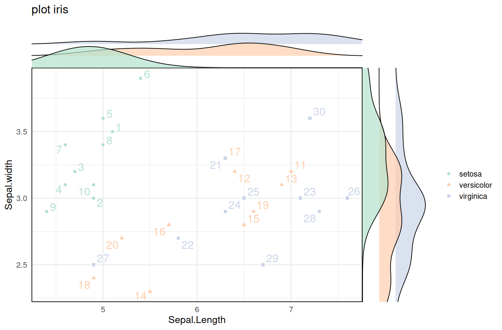

# ggScatRidges: Scatter Plot Combined with Ridgelines in 'ggplot2'

`ggScatRidges` is a simple function combining a scatter plot to a ridgeline plot to visualise the disparities of the data points. This helps visualising the distribution of different groups in the data.


## Installation

Please install the stable release from CRAN:

``` r
install.packages("ggScatRidges")
```

Alternatively, you can install the latest development version from github:

``` r
remotes::install_github("matbou85/ggScatRidges")
```

## Basic usage

``` r
library(ggScatRidges)

ggScatRidges(x = iris$Sepal.Length, y = iris$Sepal.Width, group= iris$Species, 
             color = "lancet", ridges = TRUE, title = "plot iris", legend.title = "Grouping",
             xlab = "Sepal.Length", ylab = "Sepal.Width", base_size = 15, size = 2, 
             draw = TRUE, density_2d = TRUE, legend = TRUE, label = FALSE, text = NULL) 
```

## Change parameters: remove legend, change points shape and size

```r
library(ggScatRidges)

ggScatRidges(x = iris$Sepal.Length, y = iris$Sepal.Width, group= iris$Species, 
             color = "lancet", ridges = TRUE, title = "plot iris",
             xlab = "Sepal.Length", ylab = "Sepal.Width", base_size = 15, size = 3, draw = TRUE,
             density_2d = FALSE, legend = FALSE, label = FALSE, text = NULL, pch = c(10,12,14)) 
```


## Add stats

```r
library(ggScatRidges)

ggScatRidges(x = iris$Sepal.Length, y = iris$Sepal.Width, group= iris$Species, 
             color = "lancet", ridges = TRUE, title = "plot iris",
             xlab = "Sepal.Length", ylab = "Sepal.Width", base_size = 15, size = 3, draw = TRUE,
             density_2d = FALSE, legend = FALSE, label = FALSE, text = NULL, pch = c(10,12,14),
             stats = TRUE, stats_method = "eu", anno_size = 6, anno_pos = "Up") 
```


## PCA usage application

``` r
library(ggScatRidges)
library(factoextra)
 
pca <- prcomp(iris[,1:4])
PC1=pca$x[,1]
PC2=pca$x[,2]
eig.val <- get_eigenvalue(pca)
xlab <- paste0("PC1: ", round(eig.val[1,3], digits = 1), "% variance")
ylab <- paste0("PC2: ", round(eig.val[2,3] - eig.val[1,3], digits = 1), "% variance")
  
ggScatRidges(x = PC1, y = PC2, group= iris$Species, 
             color = "lancet", ridges = TRUE, title = "PCA iris",
             xlab = xlab, ylab = ylab, size = 2, draw = TRUE,
             density_2d = TRUE, legend = TRUE, label = FALSE, text = NULL)

```


## Plot from dataframe

``` r
library(ggScatRidges)
library(dplyr)

iris2 <- iris[,c(1,2,5)] ## The first column will be used as 'x', the second as 'y' and the third as group for plotting.
iris2 <- iris2 %>% group_by(Species) %>% slice(1:10)
iris2$name <- c(1:30) ## The fourth column is used for naming.

ggScatRidges(x = iris2, 
             color = "lancet", ridges = TRUE, title = "plot iris",
             xlab = "Sepal.Length", ylab = "Sepal.width", size = 2, draw = TRUE,
             density_2d = FALSE, legend = TRUE, label = TRUE)

```




This function is loosely inspired by one of the plots in [a post](http://www.sthda.com/english/articles/24-ggpubr-publication-ready-plots/78-perfect-scatter-plots-with-correlation-and-marginal-histograms/) by [Alboukadel Kassambara](http://www.sthda.com/english/user/profile/1) from 2017.


